# T4A2-A - Full Stack Application - Part A

---  

### R1 - Application Description  

#### Purpose  
This web application is a site where developers and creators are able to show off their projects to others and receive external feedback. This gives a developer a wider array of opinions they might otherwise not be able to have see their app so that they:
- Know what works well in their current project
- What they can do to improve their current project
- Can learn techniques and strategies for future projects

#### Functionality / Features  
- Sign in / Sign up (optionally with Google/Github)
- Create and View projects
- Read and Provide Feedback on projects

#### Target audience  
Developers (particularly beginner-level) who have created an application/project/portfolio website that are seeking feedback from other developers whether they are front-end, back-end or full stack.

#### Tech stack
- Python: Back end programming language
- PostgreSQL: Back end database
- Flask: Application Web Framework
- Jinja2: Web templating
- Gunicorn: WSGI Server
- NGINX: Web server
- HTML5 + CSS + Bootstrap: Front end rendering
- Amazon EC2: Application and Database Host Server

---  

### R2 - Dataflow Diagram  

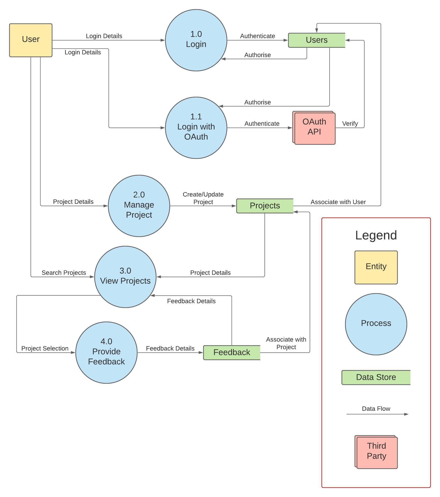

#### - 1.0: User Login with account
User logs in with their credentials to receive a authorisation token.  

#### - 1.1: User Login with external account
User logs in with Google/Github to receive a authorisation token.  

#### - 2.0: Manage Project
User enters project details into a form to create/update their project.

#### - 3.0: View Projects
User retrieves project details and associated feedback for that project.

#### - 4.0: Provide Feedback
User enters feedback into a form to create feedback associated with the project.

---  

### R3 - Application Architecture Diagram  

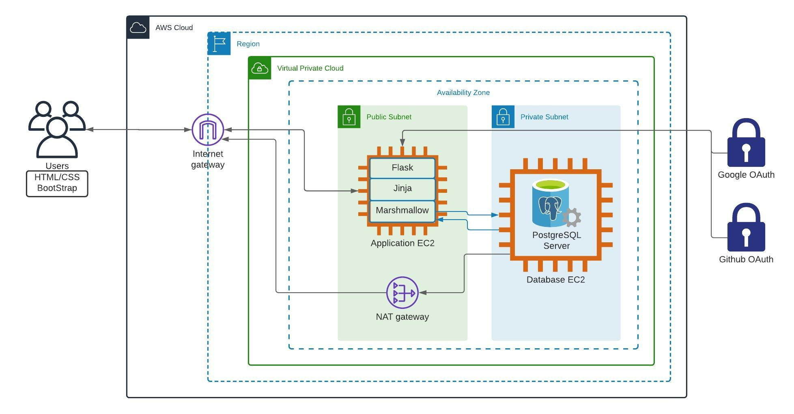

This app's backend will be written in Python and be hosted within the AWS Cloud, with a HTML/CSS frontend serving a web page to the end user. The application server will be hosted on an EC2 instance and will be connected to another EC2 instance serving as the database server.

The application server will host a Flask web app using NGINX to run the web server. To interface with the database, the Marshmallow ORM will be used. Jinja2 and Bootstrap will connect the backend API endpoints to template the web site interfaced by the user.

The database server will run a PostgreSQL Server and be within a private subnet to ensure that the data within cannot be accessed externally. To connect the database to the internet, the database server will interface with the NAT gateway to provide the private IP.

Both back end servers would exist within the same virtual private cloud so that they can communicate with each other. Only the application server can be directly accessed through the internet as it will exist in a public subnet.

An internet gateway configured at the VPC will allow the application to have access to the internet while also forwarding data to the correct subnet.

The Google and Github API will also have data sent to them in order to authorise users. They will return access tokens when verified.

---  

### R4 - User Stories  

#### Login  
- As a *user*, I want to be able to login, so that my projects and feedback are saved.
- As a *user*, I want the option to login using Google/Github, so that it is convenient for me.

#### Managing a Project  
- As a *developer*, I want to share a link to my project, so others can see my project
- As a *developer*, I want to provide a description of my project, so others understand the use case and context of it.
- As a *developer*, I want to assign tags to my project, so that when others find my project they can provide relevant feedback.

#### Viewing a Project  
- As a *user*, I want to be able to search for projects by tag, so that I can provide feedback within my area of knowledge.
- As a *user*, I want to open a link from the project page, so that I can conveniently see the developer's project as intended.

#### Providing Feedback on a Project
- As a *user*, I want to provide feedback on a project, so that the developer can know what they did well and where they can improve.
- As a *user*, I want to be able to view other's feedback on a project, so I can avoid repeating feedback.
- As a *user*, I want to be able to hide other's feedback, so I can form an opinion without impact from external interference.

#### Reading Feedback on a Project
- As a *developer*, I want to read feedback on a project page, so it is convenient and so I know for which project the feedback is for.
- As a *developer*, I want to see when feedback was made, so I know if the feedback is relevant to the current state of my project.
- As a *developer*, I want to be able to hide feedback, so I can avoid reading feedback I've already seen.

---  

### R5 - Wireframes

#### Sign-in / Sign-up
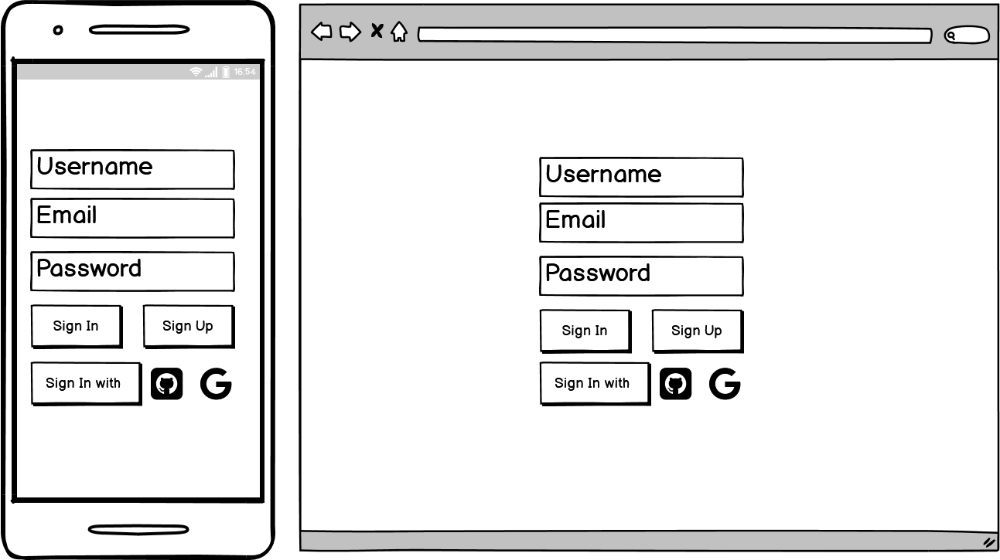  

Page for signing in or creating an account.  

*Sign In* button is connected to a POST endpoint for retrieving a login token
*Sign Up* button is connected to POST request for account creation
*Sign In with Google/Github* button redirects to the respective OAuth Endpoint to retrieve a login token.

#### Create Project
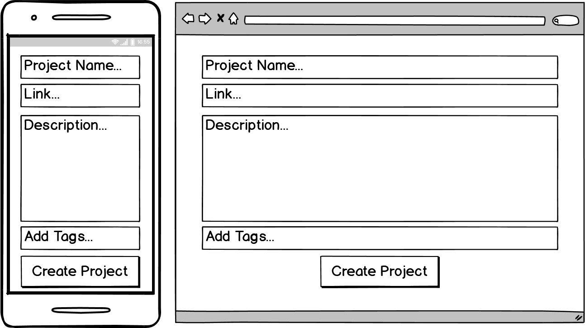  

Page for developers to create a project.  

Developers fill in form data to generate a POST request to create a *project* entity.  

#### Modify Project
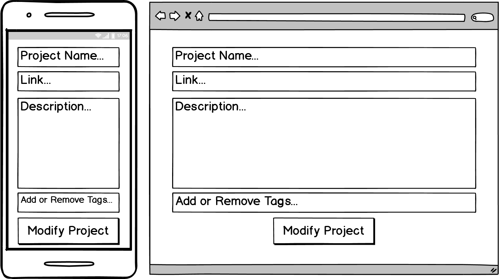  

Page for developers to modify a project.  

Developers fill in form data to generate a PUT request to update a *project* entity.  

#### Search Projects
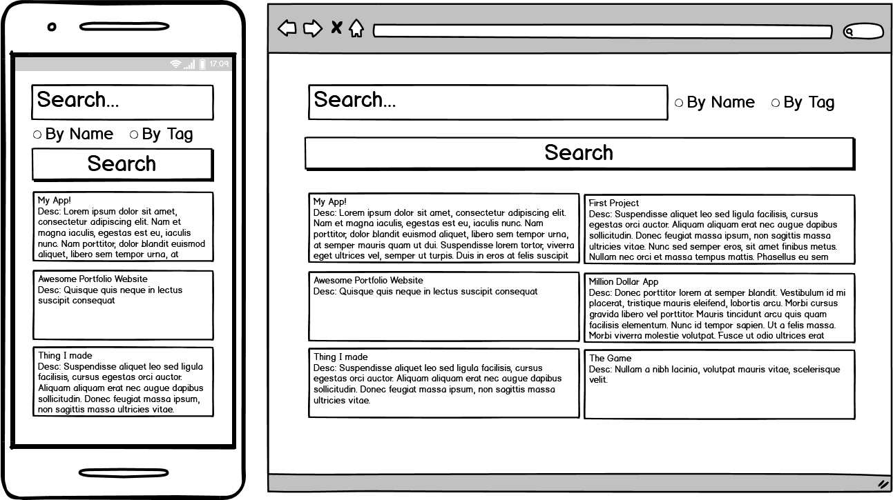  

Page for users to search for projects.  

Users fill in form data to generate a GET request to retrieve matching *project* entities.  

#### View Project
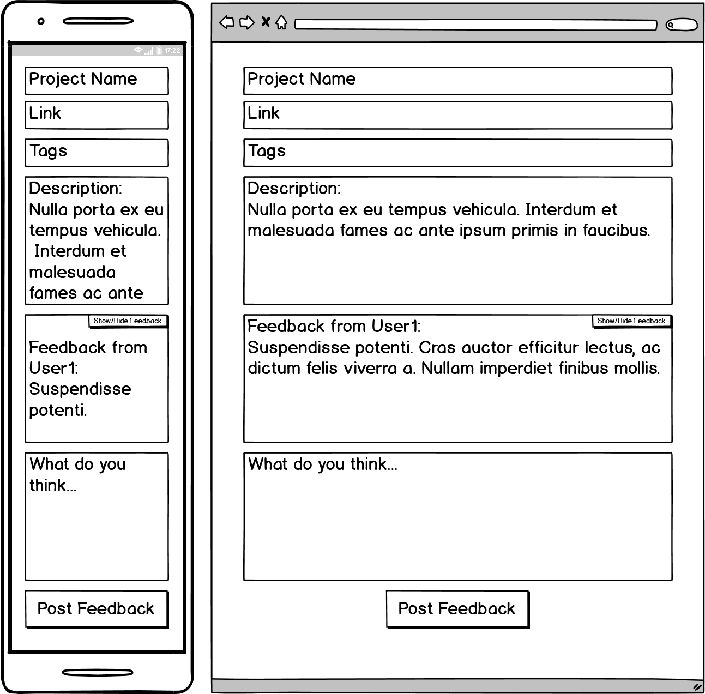  

Page for users to view a project.  

Result of a GET request to retrieve *project* entity details and *feedback* entity details.
Users may fill in the text field linked to the *Post Feedback* button to generate a POST request to create a *feedback* entity associated with the current *project* entity.  

#### View Feedback (for developer)
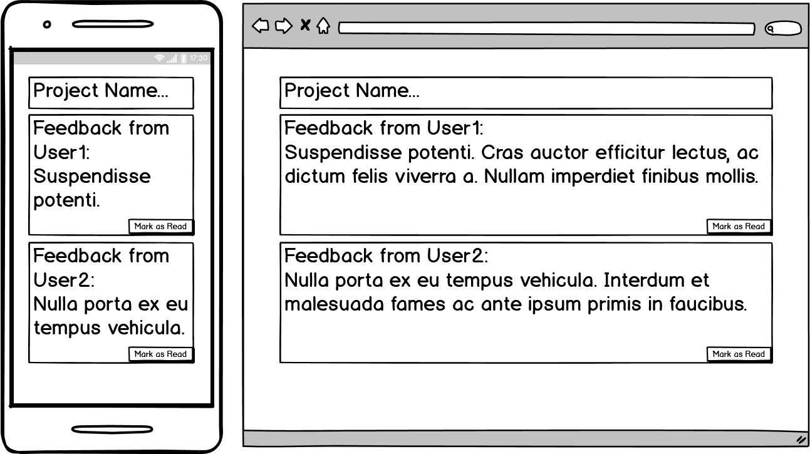  

Page for developers to view feedback on their project.  

Result of a GET request to retrieve *project* entity details.
The developer may click the *Mark as Read* button to generate a PUT request to indicate that the associated *feedback* entity has been read.  

---  

### R6 - Project Management  

The state of the Trello board used to manage the project is taken at the start of the project and the end of each working day where significant progress is made (days where cards don't move are not shown).  
Notable card notes are provided after each day.  

#### Start of Project
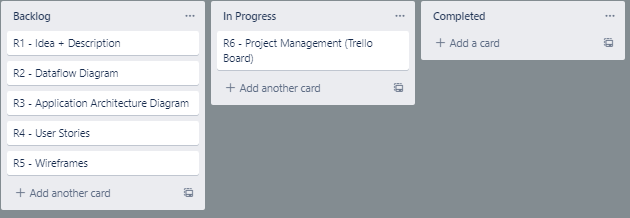  
**Trello** board created.

#### End of Day 1
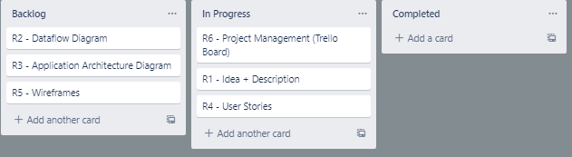  
Start work on **User Stories** in order to solidify specifics of features and implementation.  

#### End of Day 2
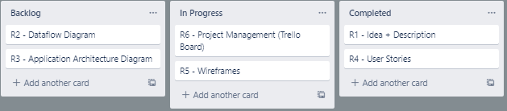  
**User Stories** "completed", can start working on **Wireframes** to reflect required functionality.  

#### End of Day 3
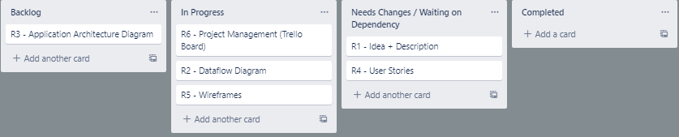  
Updated **User Stories** to reflect external requests and waiting for feedback.  
**Description** to be updated with specific information as other requirements are completed.  
Continue work on **Wireframes** and modify previous wireframes in reponse to feedback.  

#### End of Day 4
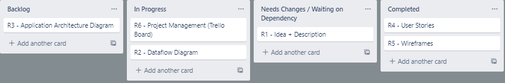  
**User Stories** and **Wireframes** completed.  
Work on **Dataflow Diagrams** started to reflect wireframes and user stories.  
**Description** Updated with 'Functionality and Features' reflecting user stories.  

#### End of Day 5
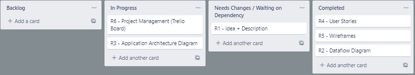  
**Dataflow Diagram** completed.  
**Application Architecture Diagram** started.  

#### End of Day 6
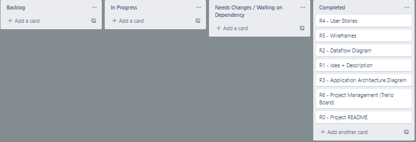  
**Application Architecture Diagram** and **Project Management** completed.  
**Description** Updated with 'Tech Stack' reflecting application architecture diagram.  
**README** Completed and packaged.  